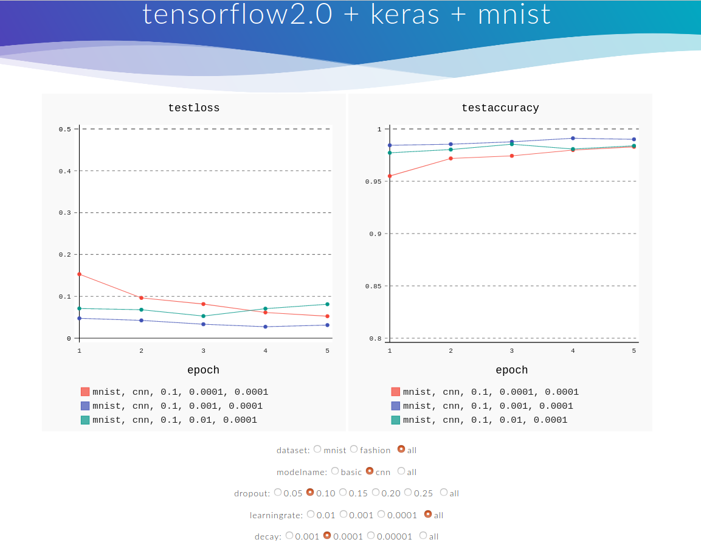
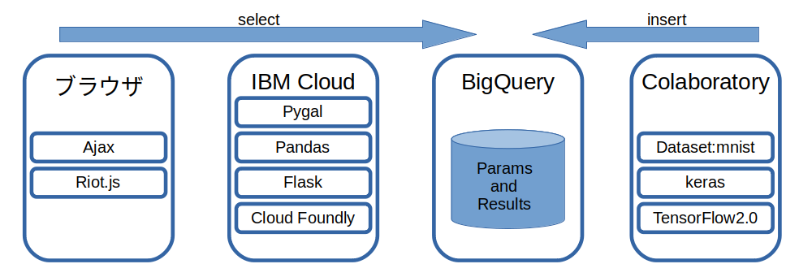
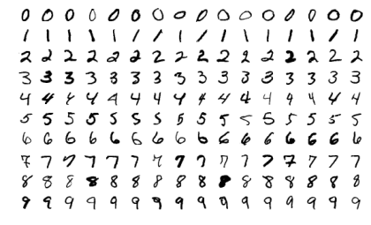

## Training TensorFlow2.0
背景
1. MNISTの学習結果が見たいけど、時間が無い。  
1. 学習済みのハイパーパラメータを覚えていられない。  
1. グラフで比較がしたい。  

## 今すぐ、MNISTの学習結果を比較したい。
Comparing to Hyperparameters for MNIST dataset.  
https://flas.mybluemix.net/

## 画面イメージ


## 仕組み


## dataset
https://en.wikipedia.org/wiki/MNIST_database  
https://github.com/zalandoresearch/fashion-mnist  




## 学習結果データ
data image on BigQuery.
```
date dataset modelname  dropout optimizer  learningrate   decay  epochs  testloss  testaccuracy  trainloss  trainaccuracy
0  2020-02-24 14:44:23.681048+00:00   mnist     basic      0.2      adam        0.0010  0.0001       5  0.137137        0.9575   0.300755       0.913167
1  2020-02-24 14:44:23.681048+00:00   mnist     basic      0.2      adam        0.0010  0.0001       5  0.099802        0.9699   0.145056       0.957733
2  2020-02-24 14:44:23.681048+00:00   mnist     basic      0.2      adam        0.0010  0.0001       5  0.084095        0.9724   0.110526       0.966867
3  2020-02-24 14:44:23.681048+00:00   mnist     basic      0.2      adam        0.0010  0.0001       5  0.075472        0.9757   0.089928       0.972917
4  2020-02-24 14:44:23.681048+00:00   mnist     basic      0.2      adam        0.0010  0.0001       5  0.074363        0.9777   0.075333       0.977017
5  2020-02-24 14:49:37.935367+00:00   mnist     basic      0.2      adam        0.0001  0.0001       5  0.331583        0.9140   0.694931       0.813017
6  2020-02-24 14:49:37.935367+00:00   mnist     basic      0.2      adam        0.0001  0.0001       5  0.265084        0.9270   0.343613       0.903733
7  2020-02-24 14:49:37.935367+00:00   mnist     basic      0.2      adam        0.0001  0.0001       5  0.232031        0.9345   0.287555       0.919050
8  2020-02-24 14:49:37.935367+00:00   mnist     basic      0.2      adam        0.0001  0.0001       5  0.211030        0.9398   0.255987       0.927350
9  2020-02-24 14:49:37.935367+00:00   mnist     basic      0.2      adam        0.0001  0.0001       5  0.196413        0.9447   0.235488       0.934167
```

## Colaboratory
https://colab.research.google.com/

## BigQuery
https://cloud.google.com/bigquery

## IBM Cloud
https://cloud.ibm.com/

## install
```
pip install pygal
pip install ibmcloudenv
pip install pandas_gbq
```

## code

1. mnist/1.py keras simple model.  
1. mnist/2.py keras simple model with matplotlib.  
1. mnist/3.py keras simple model with matplotlib on Colaboratory.  
1. mnist/4.py keras cnn model with matplotlib on Colaboratory.  
1. mnist/5.py keras cnn model with matplotlib.  
1. bigquery/0.py for auth on Colaboratory.  
1. bigquery/1.py bigquery, pandas, read and write sample.  
1. bigquery/2.py mnist, adam, pandas, bigquery on Colaboratory.  
1. bigquery/3.py mnist, adam, pandas, bigquery on Colaboratory.  

## memo
keras optimizers.  
```
SGD: old and basic.  
Adagrad: L2ノルムベース  
RMSprop: L2ノルムベース、AdaGradを改良  
Adadelta: AdaGradやRMSPropを改良  
Adam: RMSProp and Momentum.  
Nadam: RMSProp and NAG(Nesterov's accelerated gradient).  
Adamax: 無限ノルムに基づくAdamの拡張  
```
